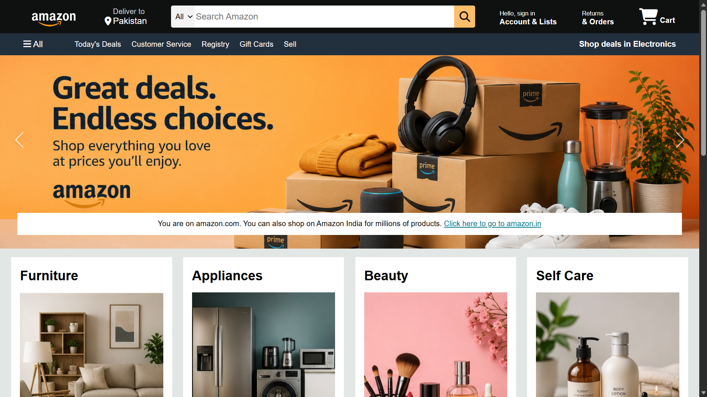
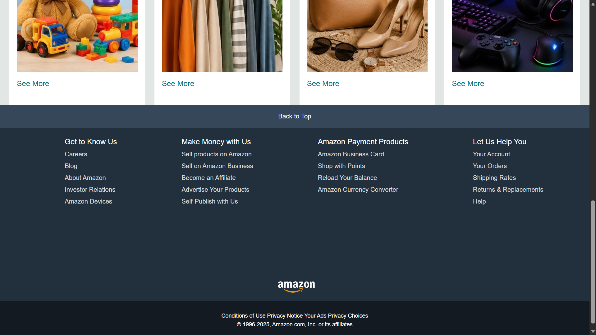

# Amazon Clone

A responsive Amazon homepage clone built using **HTML** and **CSS** as part of my web development learning journey.

---

## Features

- Responsive navigation bar
- Hero section
- Shopping category cards
- Footer
- Clean and organized layout
- Pure HTML & CSS (No JavaScript)

---

## Technologies Used

- HTML5
- CSS3

---

## 📂 Project Structure

```text
amazon-clone/
│
├── index.html
├── style.css
├── README.md
└── images/
    ├── amazon_logo.png
    ├── hero_image.jpg
    ├── box1_image.jpg
    ├── box2_image.jpg
    ├── box3_image.jpg
    ├── box4_image.jpg
    ├── box5_image.jpg
    ├── box6_image.jpg
    ├── box7_image.jpg
    ├── box8_image.jpg
    ├── Screenshot1.png
    └── Screenshot2.png
```

## Git & GitHub Workflow

- Initialized Git repository
- Created GitHub repository
- Added project files
- Committed changes
- Pushed project to GitHub

---

## Screenshots

### Homepage



### Footer



---

## Author

**Aliza Sohail**

GitHub: https://github.com/alizasohail103

---

⭐ This project is part of my web development learning journey.is part of my web development learning journey.part of my web development learning journey.
